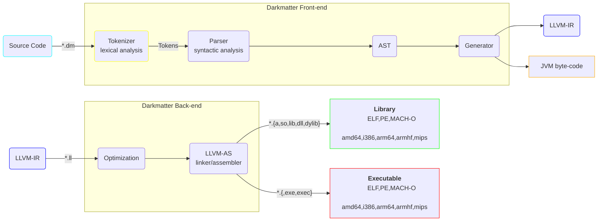

<p align="center">
	
</p>

<h1 align="center">Darkmatter</h1>

A programming language from another universe.

Darkmatter is a fast & efficient general-purpose programming language simlar to Java/C/C#/Rust.

This is the Darkmatter compiler project, its goal is to output LLVM-IR assembly which then is assembled into a native platform/architecture-specific binary (executable/library) or output JVM byte-code.

**NOTE: This is a volunteer-effort project. This means we work on this project when we have time. Large portions of the project may currently be missing or broken for the time-being until more progress is made!**

<!-- omit in toc -->
### [ [Homepage](https://darkmatter.anthonyw.me) / [RFCs](https://github.com/darkmatter-lang/rfcs) ]

[](https://github.com/darkmatter-lang/darkmatter/actions/workflows/ci.yml)
[](https://opensource.org/licenses/MIT)


<!-- omit in toc -->
### Table of Contents

- [Feature Roadmap](#feature-roadmap)
	- [Compiler Parts](#compiler-parts)
	- [Syntax](#syntax)
	- [Compiler](#compiler)
	- [Standard Library](#standard-library)
	- [Package Manager](#package-manager)
- [Specification](#specification)
- [Compiler Logging](#compiler-logging)
	- [Logging Levels](#logging-levels)
	- [Console Logging](#console-logging)
	- [File Logging](#file-logging)
- [FAQ](#faq)
	- [Why Darkmatter?](#why-darkmatter)
	- [What is Darkmatter's color palette?](#what-is-darkmatters-color-palette)
	- [How are variables defined?](#how-are-variables-defined)
	- [Why is printing to the console weird?](#why-is-printing-to-the-console-weird)
	- [Why is the data-type string lower-case and not upper-case like Java?](#why-is-the-data-type-string-lower-case-and-not-upper-case-like-java)
	- [What are Functions vs Methods?](#what-are-functions-vs-methods)
- [Getting Help](#getting-help)
- [Reporting Issues](#reporting-issues)
- [Contributors](#contributors)
- [License](#license)


## Feature Roadmap
[Feature Roadmap]: #feature-roadmap

### Compiler Parts
[Compiler Parts]: #compiler-parts

Darkmatter's compiler is segmented into 2-parts.

- Front-End (lexer, parser, linter, AST)
  - [ ] Currently under discussion to be written in Rust or Java
  - [ ] Syntax Definitions & Structure
  - [ ] Parse compiler flags and arguments
  - [ ] Input Darkmatter (`.dm`)
  - [ ] Lexer / Parser / Tokenizer
  - [ ] AST
  - [ ] LLVM codegen() for AST
  - [ ] Optimize produced LLVM-IR (depending on optimization-level)
  - [ ] Output LLVM-IR (`.ll`)
- Back-End (assemble IR) - Input IR / Output Native Binary or JVM byte-code
  - [ ] *TBA*
  - [ ] Input LLVM-IR (`.ll`)
  - [ ] Linker - https://lld.llvm.org/
  - [ ] Output Native Binary Static Library (`.a`, `.lib`)
  - [ ] Output Native Binary Dynamic Library (`.so`, `.dll`)
  - [ ] Output Native Binary Executable (`.exec`, `.exe`)
  - [ ] Output JVM byte-code (`.class`)

### Syntax
[Syntax]: #syntax

The Darkmatter grammer and syntax requirements.

- [ ] Unsigned primitives
- [ ] Operator overloading
- [ ] Scopes / Contexts
- [ ] Functions (non-class) and Methods (class)
- [ ] Structs
- [ ] References ("String Literal" -> &string)
- [ ] FFI

### Compiler
[Compiler]: #compiler



<!-- omit in toc -->
##### Currently considering RAII (Resource Acquisition Is Initialization/Scope-Bound Resource Management) for memory management.


- [ ] Output LLVM-IR assembly
  - [ ] Compile LLVM-IR to platform/architecture binary (supported ABI/ISAs):
    - [ ] Linux/amd64     (Intel/AMD 64-bit)
    - [ ] Linux/aarch64   (RISC ARMv8 64-bit)
    - [ ] Linux/mips64    (RISC MIPS III ISA VR4300 / R5900)
    - [ ] Linux/x86       (Intel/AMD 32-bit)
    - [ ] MacOS/amd64     (64-bit)
    - [ ] MacOS/aarch64   (RISC ARMv8 64-bit)
    - [ ] Windows/x86     (Intel/AMD 32-bit)
    - [ ] Windows/amd64   (RISC ARMv8 64-bit)
- [ ] Output JVM byte-code
- [ ] `dmc` - Compiler flags/options/args (`ARGS*` are the input Darkmatter source-files to compile)
  - `-l`, `--log-level` - Specify the logger level (`TRACE`, `DEBUG`, `INFO`, `WARN`, `ERROR`) (Default: `INFO`)
  - `-j`, `--threads` - Specify threads for compilation/transpilation
  - [ ] `compile` - Compile Darkmatter directly to a native binary (library/executable)
    - `-o`, `--output` - Output destination of the library/executable
    - `-t`, `--target` - Specify the target platform/architecture
    - `-k`, `--library` - Specify the library type (`static`/`dynamic`) (Default: `static`)
    - `-A`, `--emit` - Only emit LLVM-IR assembly, do not assemble.
    - `-O`, `--optimize` - Optimization level (`0`=no optimization, `2`=aggressive optimization) (Default: `0`)
  - [ ] `generate` - Compile Darkmatter to JVM byte-code
    - `-o`, `--output` - Output file destination
    - `-b`, `--byte-code` - The byte-code language to produce (`jvm`) (Default: `jvm`)

Examples:
```sh
## AoT Examples

# Compile `count_to_ten.dm` to a native executable binary named `count`
dmc compile --output count count_to_ten.dm
dmc compile -o count count_to_ten.dm

# Compile `count_to_ten.dm` to a native `linux/amd64` executable binary (ELF)
dmc compile --output count --target linux/amd64 count_to_ten.dm
dmc compile -o count -t linux/amd64 count_to_ten.dm


## JIT Examples

# Compile `my_class.dm` to a JVM byte-code class file
dmc generate --output MyClass.class --byte-code jvm my_class.dm
dmc generate -o MyClass.class my_class.dm

# Compile `a.dm` and `b.dm` to a JVM byte-code jar file
dmc generate --output MyApp.jar --byte-code jvm a.dm b.dm
dmc generate -o MyApp.jar a.dm b.dm
```


### Standard Library
[Standard Library]: #standard-library

The Standard Library `stdlib` is the standard-API that all Darkmatter programs have access to which allows developers to access parts of a user's underlying system devices and resources.

- [ ] core
  - [ ] system
    - [ ] Console
    - [ ] Process
  - [ ] types
    - [ ] scalar
    - [ ] boolean
    - [ ] char
    - [ ] reference (&string)
    - [ ] arrays
    - [ ] version (semver)
  - [ ] ffi
- [ ] filesystem
- [ ] network
- [ ] graphics
  - [ ] OpenGL bindings
  - [ ] Vulkan bindings
- [ ] audio


### Package Manager
[Package Manager]: #package-manager

Currently the package-manager is planned to be built-in with the compiler.

All packages are downloaded to the local-project directory, no files are stored elsewhere.

- [ ] Read `project.toml`.
- [ ] Fetch project/lib by `URL` from Git (you must specify the URL).
- [ ] Fetch project/lib by `username/name:version` from Darkmatter's site.
- [ ] Fetch project/lib by `username/name:version` from DHT (P2P network).
- [ ] CLI Args/flags
  - [ ] `--pkg-init` - Initialize the current directory as a project that can be packaged (creates `project.toml` if it does not exist, and adds `.darkmatter-pkgs/` to `.gitignore`)
  - [ ] `--pkg-info` - Print info on the current local-project.
  - [ ] `--pkg-update` - Update all local-project dependencies.
  - [ ] `--pkg-add` - Add a local-project dependency by `URL` or `username/name:version` pair on Darkmatter's site or DHT network.
  - [ ] `--pkg-remove` - Remove a local-project dependency by its `name:version`.
- [ ] **Separate project**
  - [ ] Rename? (partical-`accel`-erator or `tess`eract)
  - [ ] Source-code generator `tess --generate gen-config.toml` based on a JSON/markup-file.


## Specification
[Specification]: #specification

- Directly compiled language, no JIT.
- Can output a static/shared library (.so/.dll/.dylib) or executable (ELF/PE/MACH-O).
- Similar to Java/C# syntax.
- RAII (no Garbage Collector)?


## Compiler Logging
[Compiler Logging]: #compiler-logging

### Logging Levels
[Logging Levels]: #logging-levels

The default logging levels are as follows:
- `TRACE` Most verbose, all debug messages will be shown including internal process states.
- `DEBUG` Verbose debugging messages will be shown, may contain sensitive information.
- `INFO` Normal, only informational messages will be shown.
- `WARN` Only warning messages will be shown along with errors.
- `ERROR` Strictly only error messages will be shown.

### Console Logging
[Console Logging]: #console-logging

Console logging is always enabled but can be limited to only showing certain messages tagged with specific severities such as `WARN` OR `ERROR`.

This is by-design.

### File Logging
[File Logging]: #file-logging

File logging can be enabled by either passing in a valid file path as to where logs will be stored, by setting the environment variable `LOG_FILE` to a valid path, or by configuring this via the Java API.


## FAQ
[FAQ]: #faq

### Why Darkmatter?
[Why Darkmatter?]: #faq-why-darkmatter

Because it sounds cool :)

> I invision Darkmatter as an alternative language syntactically-similar to Java/C# but while still allowing for fast low-level access.
>
> Darkmatter is designed to be efficient, simple, clean, fast and platform-independent.
> 
> Some limitations of Java include:
> - JVM JIT-only compilation (inability to compile directly to a specific platform/architecture)
> - Lack of unsigned scalar types (`uint8`, `uint16`, `uint32`, `uint64`)
> - Lack of a non-painful FFI to other languages; Assembly, C, C++, etc.
>
> Some limitations of C# include:
> - CLR/.NOT core is Windows-first support, other platforms are 3rd-class citizens.
> - A native binary created in Java by GraalVM native-image is still faster.
> - PascalCase is disgusting.
> 
> \- [anthonywww](https://github.com/anthonywww)


### What is Darkmatter's color palette?
[What is Darkmatter's color palette?]: #faq-what-is-darkmatters-color-palette?

Darkmatter adopts the color-palette  `#00FFFF`,  `#045454` and  `#000000`.

We would appreciate [GitHub Linguist](https://github.com/github-linguist/linguist) classifying Darkmatter as  `#00FFFF`.


### How are variables defined?
[How are variables defined?]: #faq-how-are-variables-defined

All variables are statically-typed and immutable by default.
You can declare a variable like so:
```dm
// Integers
int32 unsigned_number = 3;

// Strings
string message = "Hello, World!;

// For everything else:
var x = "something else";
```


### Why is printing to the console weird?
[Why is printing to the console weird?]: #faq-why-is-printing-to-the-console-weird?

If you are asking why we don't have `System.out.println()`, it's because of how the Standard Library (stdlib) is structured.

```
core (namespace)
\-- system (namespace)
    \-- Console (class)
	    \-- writeLine (method)
```

`Console` is the class that is responsible for I/O with the underlying terminal.
Whereas `writeLine()` is a method that lets you print a message to the console which will also append a `\n` character to the end of your provided message.

We chose `write` instead of `print` because just like with other I/O operations, such as files or sockets, you are `write()`-ing or `read()`-ing to the device/buffer.

Available public methods to print in the `Console` class:
- writeLine(...)
- write(...)
- writef(string format, ...) 

If you really prefer `printf()` or `println()` over the methods above, discussion/proposals/suggestions are open on how these can be implemented without breaking convention/standards while keeping namespaces clean.


### Why is the data-type string lower-case and not upper-case like Java?
[Why is the data-type string lower-case and not upper-case like Java?]: #faq-why-is-string-lower-case?

Because in Darkmatter a string is a Primitive data-type and not an Object.

It should be noted, Primitives in Darkmatter may have functions attached to them.


### What are Functions vs Methods?
[What are Functions vs Methods?]: #faq-what-are-functions-vs-methods

As with other languages, a Method is basically just a member-function of a class in OOP.

Example:

```dm

// A function that adds 1 to an integer.
uint32 myFunction(uint32 x) {
	return x + 1;
}


public void MyClass {
	// A method that adds 1 to an integer.
	public uint32 myFunction(uint32 y) {
		return y + 1;
	}
}


int main(string[] args) {

	uint32 my_number = 3;

	// Function invocation
	uint32 function_result = myFunction(my_number);
	Console.writeLine(function_result); // 4

	// Method invocation
	MyClass my_class = new MyClass();
	uint32 method_result = my_class.myFunction(my_number);
	Console.writeLine(method_result); // 4

}
```


## Getting Help
[Getting Help]: #getting-help

Are you having trouble with Darkmatter? We want to help!

- If you are upgrading, read the release notes for upgrade instructions and "new and noteworthy" features.
- Ask a question we monitor stackoverflow.com for questions tagged with darkmatter. You can also talk with the community on X.
- Report bugs with Darkmatter at [https://github.com/darkmatter-lang/darkmatter/issues](https://github.com/darkmatter-lang/darkmatter/issues).
- Join the Discussion on X and be part of the community [https://twitter.com/i/communities/1727990925480079392](https://twitter.com/i/communities/1727990925480079392)


## Reporting Issues
[Reporting Issues]: #reporting-issues

Darkmatter uses GitHub’s integrated issue tracking system to record bugs and feature requests. If you want to raise an issue, please follow the recommendations below:

- Before you log a bug, please search the issue tracker to see if someone has already reported the problem.
- If the issue doesn’t already exist, create a new issue.
- Please provide as much information as possible with the issue report. We like to know the Darkmatter version, operating system etc you’re using.
- If you need to paste code or include a stack trace, use Markdown. ``` escapes before and after your text.
- If possible, try to create a test case or project that replicates the problem and attach it to the issue.


## Contributors
[Contributors]: #contributors

The following contributors have either helped to start this project, have contributed
code, are actively maintaining it (including documentation), or in other ways
being awesome contributors to this project. **We'd like to take a moment to recognize them.**

[](https://github.com/anthonywww)
[](https://github.com/mjovanc)

## License
[License]: #license

The MIT License.
